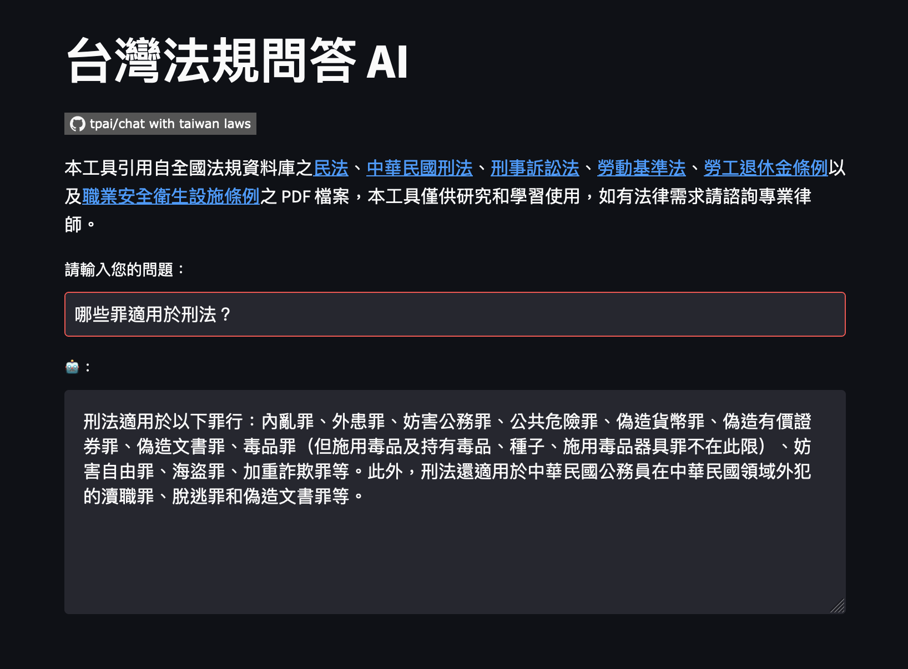

# Chat with Taiwan Laws

This tool extracts content from the PDF files of the Civil Code, Criminal Code, Code of Criminal Procedure, Labor Standards Act, Labor Pension Act, and Occupational Safety and Health Facility Regulations found in the National Regulations Database. This tool is for research and learning purposes only. Please consult a professional lawyer for any legal needs.

## Development Components

- LangChain
- FAISS
- OpenAI
- Streamlit

```sh
# install components
pip install --upgrade pip
pip install -r requirements.txt
```

## Usage

```sh
# generate vector index
python ingest.py

# define environment variables
export OPENAI_API_KEY=$OPENAI_API_KEY
export OPENAI_MODEL="gpt-4" # default value: gpt-3.5-turbo

# launch QA AI
streamlit run main.py

# launch chat AI
streamlit run chat.py
```

## Create your own QA AI

1. Replace files under `./docs` with your PDFs.
1. Remove `./faiss_index` folder.
1. Run `python ingest.py` to create vector index.
1. Launch server `streamlit run main.py`.

## Demo

### Chat

https://chat-with-taiwan-laws.streamlit.app/


### QA

https://qna-with-taiwan-laws.streamlit.app/



## FAQ

### ``openai.error.InvalidRequestError: The model: \`gpt-4\` does not exist``

- Join [GPT-4 API waitlist](https://openai.com/waitlist/gpt-4-api), or switch the model

### Switch the model

1. Choice a model via [Models - OpenAI API](https://platform.openai.com/docs/models/overview), for example: `gpt-3.5-turbo`
1. Define environment variable `OPENAI_MODEL`
