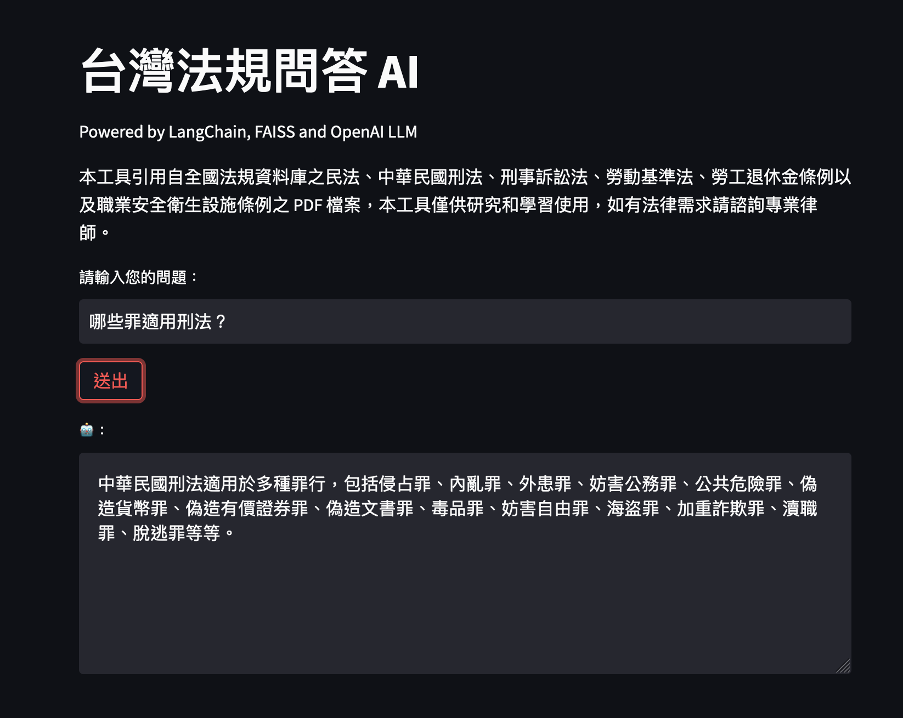

# Chat with Taiwan Laws

This tool extracts content from the PDF files of the Civil Code, Criminal Code, Code of Criminal Procedure, Labor Standards Act, Labor Pension Act, and Occupational Safety and Health Facility Regulations found in the National Regulations Database. This tool is for research and learning purposes only. Please consult a professional lawyer for any legal needs.

## Development Components

- LangChain
- FAISS
- OpenAI
- Streamlit

## Usage

```sh
# generate vector index
python ingest.py

# launch server
export OPENAI_API_KEY=$OPENAI_API_KEY
streamlit run main.py
```

## Create your own QA AI

1. Replace files under `./docs` with your PDFs.
1. Remove `./faiss_index` folder.
1. Run `python ingest.py` to create vector index.
1. Launch server `streamlit run main.py`.

## Demo

